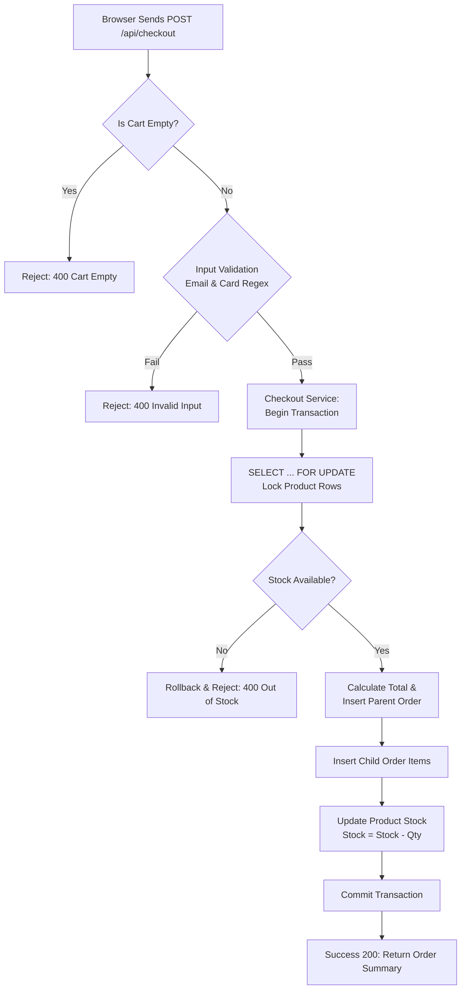

# Checkout Flow Logic Map

## 1. GenAI Prompt
**Prompt:** "Write an Express POST route for /api/checkout using a Controller-Route-Service pattern. The logic should use a MySQL transaction to: 1. Lock product rows with FOR UPDATE to prevent race conditions. 2. Verify stock availability. 3. Calculate the total server-side including shipping. 4. Insert records into 'orders' and 'order_items' tables. 5. Decrement stock. 6. Handle errors with a rollback and return specific HTTP 400 errors for invalid inputs like email regex or card formatting."

## 2. Decision Tree (Logic Map)

