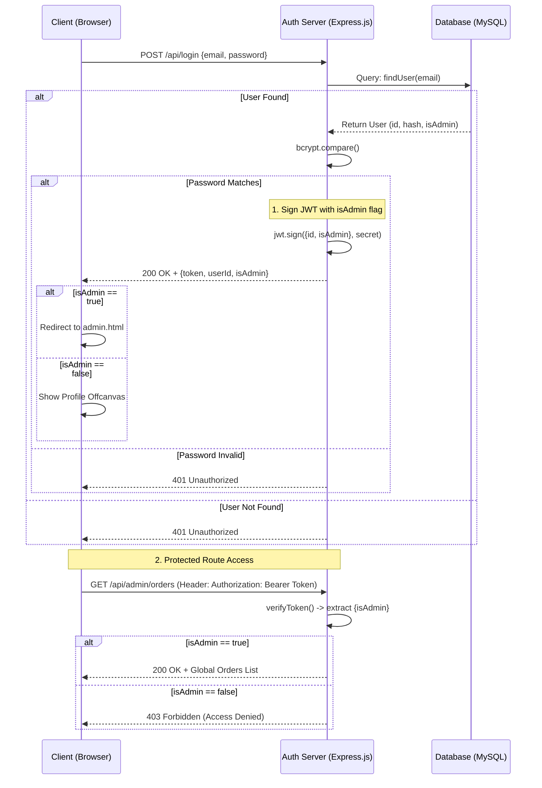

# Login & Admin Security Architecture

## Sequence Diagram (RBAC Handshake)

```mermaid
sequenceDiagram
    participant Client as Client (Browser)
    participant Server as Auth Server (Express.js)
    participant DB as Database (MySQL)

    Client->>Server: POST /api/login {email, password}
    Server->>DB: Query: findUser(email)
    
    alt User Found
        DB-->>Server: Return User (id, hash, isAdmin)
        Server->>Server: bcrypt.compare()
        
        alt Password Matches
            note over Server: 1. Sign JWT with isAdmin flag
            Server->>Server: jwt.sign({id, isAdmin}, secret)
            Server-->>Client: 200 OK + {token, userId, isAdmin}
            
            alt isAdmin == true
                Client->>Client: Redirect to admin.html
            else isAdmin == false
                Client->>Client: Show Profile Offcanvas
            end
        else Password Invalid
            Server-->>Client: 401 Unauthorized
        end
    else User Not Found
        Server-->>Client: 401 Unauthorized
    end

    note over Client, Server: 2. Protected Route Access
    Client->>Server: GET /api/admin/orders (Header: Authorization: Bearer Token)
    Server->>Server: verifyToken() -> extract {isAdmin}
    
    alt isAdmin == true
        Server-->>Client: 200 OK + Global Orders List
    else isAdmin == false
        Server-->>Client: 403 Forbidden (Access Denied)
    end
```
