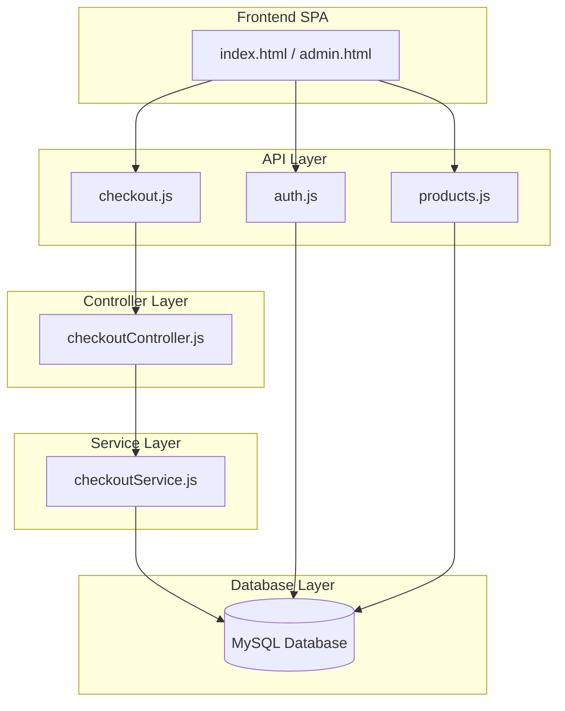

# Microservice Boundary Map (CRS Pattern)

## 1. GenAI Prompt
**Prompt:** "Act as a Software Architect. Refactor a Node.js Modular Monolith into a Controller-Route-Service (CRS) architecture. Explain how this separation of concerns maps to future microservice boundaries. Specifically, define how the Checkout Service manages independent database transactions and interacts with the Product Catalog layer."

## 2. Architectural Boundaries (Current State)

We have refactored the monolith into a strict **Controller-Route-Service (CRS)** pattern. This architectural shift ensures that business logic is isolated from HTTP handling, making it ready for future microservice extraction:

### Layer 1: Routes (Gatekeepers)
- **Files:** `backend/routes/*.js`
- **Role:** Map URLs to Controller functions.
- **Middleware:** Applies JWT `authenticateToken` and `adminOnly` protections.

### Layer 2: Controllers (Orchestrators)
- **Files:** `backend/controllers/*.js`
- **Role:** Extract request data (body, params), perform basic schema validation (regex), and send HTTP responses.
- **Independence:** They don't know *how* data is saved; they only know which Service to call.

### Layer 3: Services (Logic Engines)
- **Files:** `backend/services/*.js`
- **Role:** Execute business logic, manage SQL Transactions, and interact with the database.
- **Decoupling:** `checkoutService.js` handles the complex relational logic of atomic inventory updates and order placement.

---

## 3. Component Diagram (Microservice Thinking)

