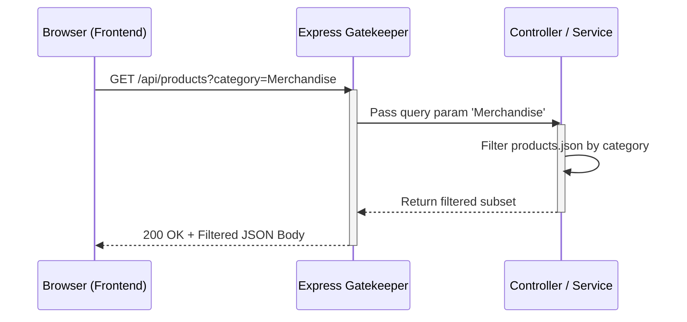

# Product Filter Architecture

## 1. The Contract Table
| Component | Request (The Order) | Response (The Delivery) |
| :--- | :--- | :--- |
| **Method** | GET | |
| **Endpoint** | `/api/products?category=Merchandise` | |
| **Headers** | `Accept: application/json` | `Content-Type: application/json` |
| **Status Code** | | 200 OK (or 500 Internal Server Error) |
| **Body** | (Empty) | `[{"id": "3", "name": "Physical Merchandise T-Shirt", "category": "Merchandise"...}]` |

## 2. Sequence Diagram

### Step 2: Write the Backend Logic (The "Gatekeeper")
Now we have to write the code that makes that query parameter actually work. Open your `server.js` file. You need to update your existing `GET /api/products` route to look for the `?category=` tag.

Replace your current product GET route with this updated version (it includes the comments required by the rubric):

```javascript
// GET /api/products - Fetch catalog with optional category filtering
app.get('/api/products', (req, res) => {
    try {
        // Step 1: The Gatekeeper checks if the client sent a specific 'category' query parameter
        const requestedCategory = req.query.category;

        // Step 2: Retrieve the raw data (simulating a database read)
        let filteredProducts = allProducts; 

        // Step 3: Process the logic. If a category was asked for, filter the array.
        if (requestedCategory) {
            filteredProducts = allProducts.filter(product => 
                product.category.toLowerCase() === requestedCategory.toLowerCase()
            );
        }

        // Step 4: Send the successful response package back to the client
        res.status(200).json(filteredProducts);

    } catch (error) {
        // Handle the "What if the server fails?" scenario
        console.error("Failed to fetch products:", error);
        res.status(500).json({ error: "Internal Server Error while fetching products." });
    }
});
```
