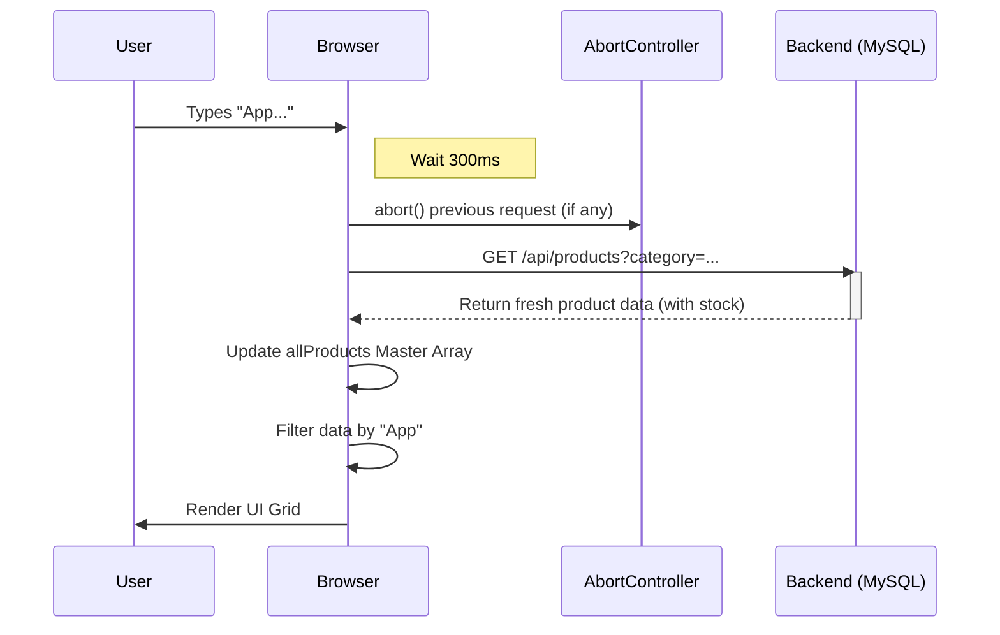

# Product Filter & Search Architecture

## 1. Concurrency Contract
| Feature | Implementation | QA Benefit |
| :--- | :--- | :--- |
| **Search Debounce** | `setTimeout(300ms)` | Prevents excessive API spam while typing. |
| **Race Condition** | `AbortController` | Kills previous fetch if user changes filters rapidly. |
| **Data Sync** | `allProducts` Master Update | Syncs local grid stock with live server data during filter. |

## 2. Sequence Diagram (Debounced Search)

