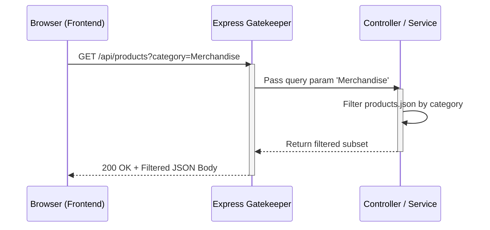

# Product Filter Architecture

## 1. The Contract Table
| Component | Request (The Order) | Response (The Delivery) |
| :--- | :--- | :--- |
| **Method** | GET | |
| **Endpoint** | `/api/products?category=Merchandise` | |
| **Headers** | `Accept: application/json` | `Content-Type: application/json` |
| **Status Code** | | 200 OK (or 500 Internal Server Error) |
| **Body** | (Empty) | `[{"id": "3", "name": "Physical Merchandise T-Shirt", "category": "Merchandise"...}]` |

## 2. Sequence Diagram

