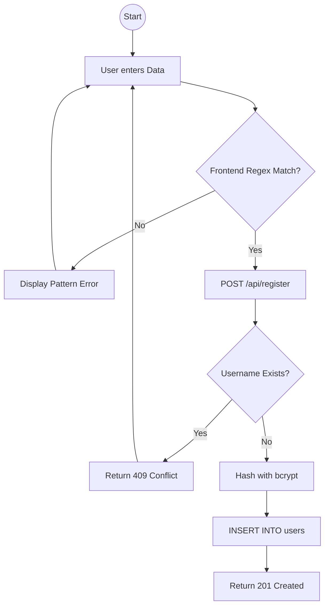

# Registration Security Architecture

## 1. Security Contract
| Layer | Constraint | Purpose |
| :--- | :--- | :--- |
| **Frontend** | Regex + Pattern | Immediate UX feedback for strong passwords. |
| **Backend** | bcrypt (Salt 10) | Ensures passwords are never stored in plaintext. |
| **Database** | Unique Constraint | Prevents duplicate usernames (email) at the storage layer. |

## 2. Activity Diagram (Validation Flow)

