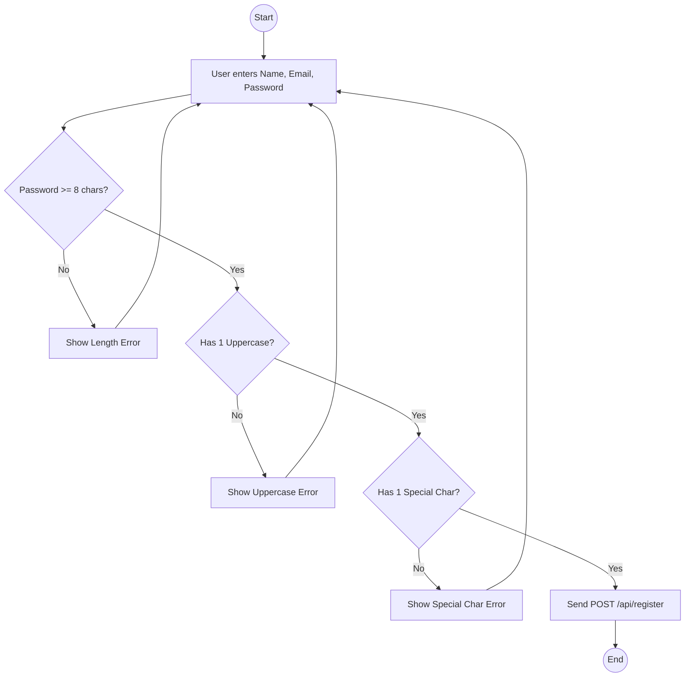
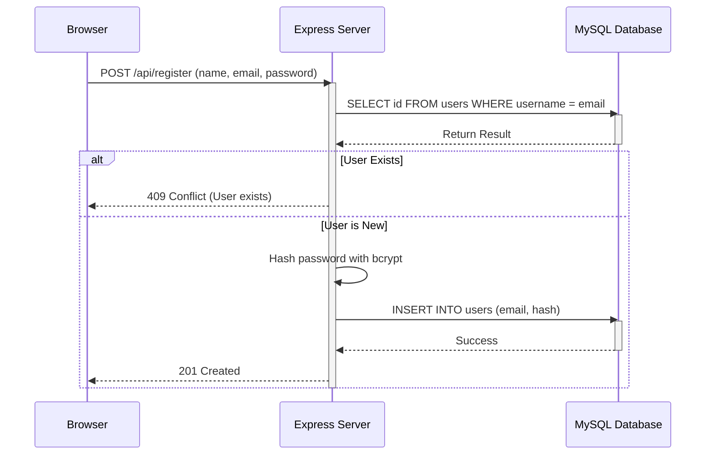

# Registration Security Architecture

## 1. Contract Table
| Component | Request (The Order) | Response (The Delivery) |
| :--- | :--- | :--- |
| **Method** | POST | |
| **Endpoint** | `/api/register` | |
| **Headers** | `Content-Type: application/json` | `Content-Type: application/json` |
| **Status Code** | | 201 Created (or 400 Bad Request / 409 Conflict) |
| **Body** | `{"name": "...", "email": "...", "password": "..."}` | `{"message": "User registered successfully"}` |

## 2. Activity Diagram (Frontend Validation)

