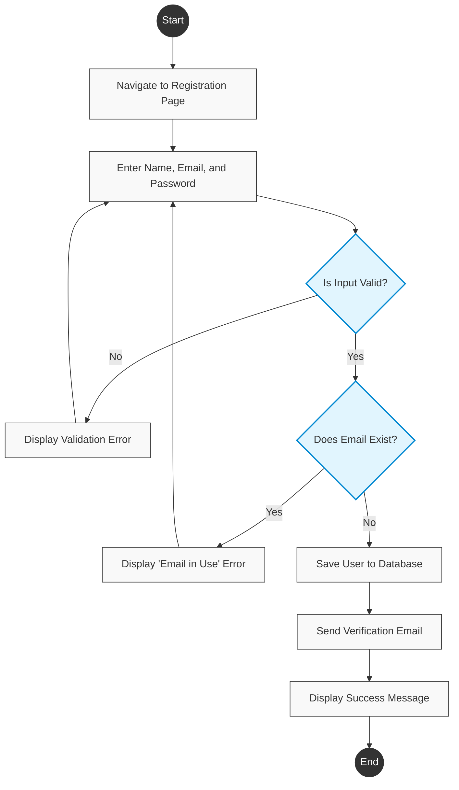
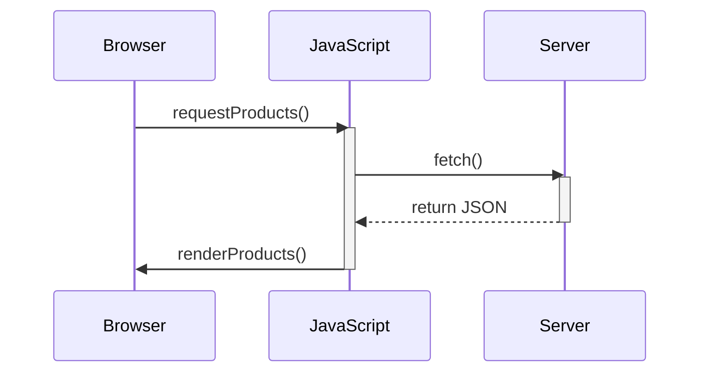
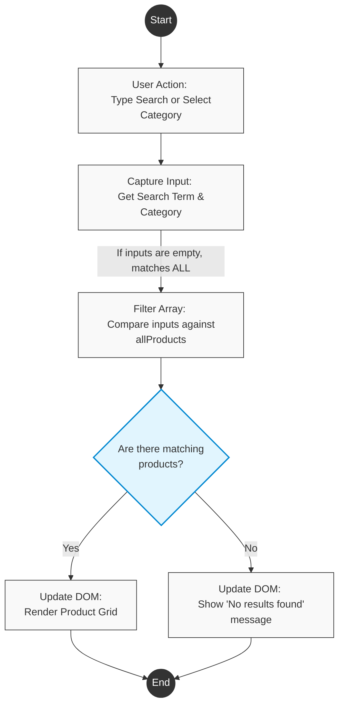

# Kaify-Uni
A repository made for my university project.
You can view the progress so far at https://kaifyuu.github.io/Kaify-Uni/





```mermaid
@startuml
left to right direction
skinparam componentStyle rectangle

' High Contrast Styling
skinparam component {
    BackgroundColor #E1F5FE
    BorderColor #0288D1
    FontColor #000000
}
skinparam database {
    BackgroundColor #FFF9C4
    BorderColor #FBC02D
    FontColor #000000
}
skinparam cloud {
    BackgroundColor #F5F5F5
    BorderColor #9E9E9E
    FontColor #000000
}

package "Client Tier (What we built)" {
    [Web Browser\n(HTML/CSS/Vanilla JS)] as Client
}

package "Application Tier (The Next Frontier)" {
    [API Router / Web Server\n(e.g., Node.js / Express)] as Server
    [Auth Controller\n(JWT / Sessions)] as Auth
    [Inventory Controller] as Inventory
    [Order & Checkout Controller] as Checkout
}

database "Data Tier (Replaces localStorage & JSON)" {
    [User Accounts DB] as UserDB
    [Product Catalog DB] as ProductDB
    [Order History DB] as OrderDB
}

cloud "External Services (Real World Integrations)" {
    [Payment Gateway\n(e.g., Stripe API)] as Stripe
    [Shipping API\n(e.g., EasyPost)] as ShipAPI
    [Email Service\n(e.g., SendGrid)] as Email
}

' Flow of data
Client <--> Server : " HTTPS / REST API \n(Replaces direct JSON fetch)"

Server --> Auth : Routes Login/Register
Server --> Inventory : Routes Product Searches
Server --> Checkout : Routes Cart Submission

Auth --> UserDB : Reads/Writes Credentials
Inventory <--> ProductDB : Reads Catalog / Updates Stock
Checkout --> OrderDB : Saves Finalized Orders
Checkout --> Inventory : Triggers Stock Reduction

Auth --> Email : Triggers "Welcome" Email
Checkout --> Stripe : Processes Real Credit Card
Checkout --> ShipAPI : Generates Real Tracking #
Checkout --> Email : Triggers "Order Confirmed" Email

@enduml
```
