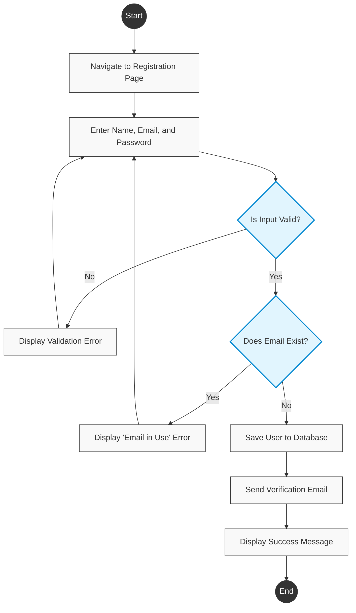
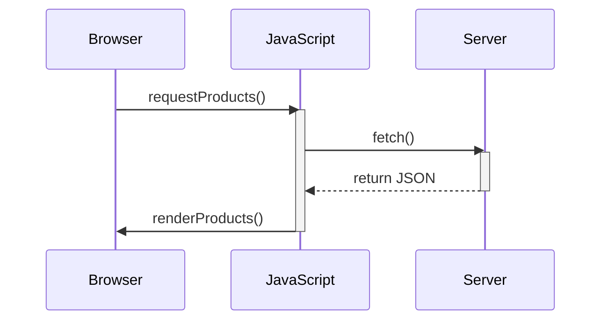
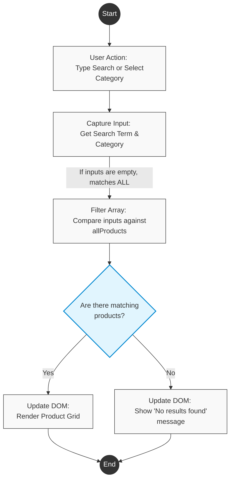

# Kaify-Uni
A repository made for my university project.
You can view the progress so far at https://kaifyuu.github.io/Kaify-Uni/

![E-Commerce System Architecture Component Diagram](https://uml.planttext.com/plantuml/png/ZLLTJzim57sFbFzmLIG-f44P6XAWQO9-X88OL4rO7xOzkCbjwk76aUrIkcd_VTUE4qe7qzeNQfzpp_6zn-PS6wRCOYx2GE3KW96WU3upa765gU6o20Fzm8kIAJQ7LCvBMM1XOhCI21R1YbnW68J13Wo825rP6CMq0GlXHVug7Nw50T2dmzA7NCb5aNMba0gs-k-ZuwZlDwNAKFcDmwEJazxxQYCYYNhPVSBWzxfCnWoRC8rlgaHHTDhzy8fArEaU7lN-JoKLSf6zBN5ilwz8dFRjzryIOL1IDPOZjBg2ssub71NiZcVCm19Xik32xBLgwQzZd417oQL6zQtO7IIVRzhTE6v_OGKNWi5rlFSTc8QgrgR2HLaAdZ8xQ2-Jp11kySb0fCWUBQr9NGolO2GNXd1jiBengaSdYmVvmJkubHaU_D2qsNyg5MfTILUekiR2-9H88HptUfmG8oOukV0KY_A4g-AHZ4krMcCvJBFXWNUspR0DtHcc3-Ho4r-l-nuqCMdrw2z_-X6MWgMeGSYKYPYgspPjKnVlRjSQSK_DXeiqfOaR3RsEgsyNUnsF62gPBLBoGBM5p6kCNsvWbUS1r-w07kGMBSJvh8BMwZzHsmicN3UvjKXcwUTOAf5HBmpcoirHh_aSijNS9kYI6LooLJEes2XU8j0y_OJSRq-APxmiwUhQxORHPterbDfuF45ernFwSyORNyyQM6INYcSLms7yYNOW4d89SkgkQXZuc7_St__aim9dq891aWnZIiQe7oVM2r3fPZxL--Jc0bCqwMolPKjxkgtaWdPMvLN3ZSnvqHvXJgssMLm3FWUiGTVJYv6fT8Rw1Rx9LmFlqXiAyM8ovox3reXJj-Wg5HQBBDFjiUAEeJ0ZKSu4rNusu5hGPAGcDI5gmtr9BKCxC9a-KETgAvRdOqEic3qI9k8K5_uJisf7Ry3NZvtGevyJfAfBgjR0vacgCQ-1MsCKzAPZgvxkY_e-OsVsF3GnJOvSOEtHkRqOAjjaLAaYoYKMgDn17ILHz5xPH6vjCFwsL5qeklbJhkQODTR2u9poIF_e_W00)
